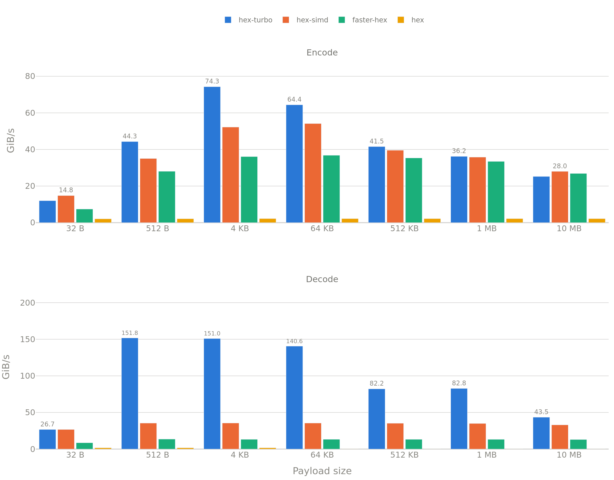

<div align="center">
  <h1>Hex Turbo</h1>
  <p><strong>A Rust hex codec that peaks past 150 GiB/s, with its <code>unsafe</code> SIMD checked by MIRI and MSan, not just by review.</strong></p>

  [](https://crates.io/crates/hex-turbo)
  [](#license)
  [](https://github.com/hacer-bark/hex-turbo/actions/workflows/tests.yml)
  [](https://github.com/hacer-bark/hex-turbo/actions/workflows/miri.yml)
</div>

<br/>

`hex-turbo` targets high-throughput systems where CPU cycles are scarce and Undefined
Behavior is unacceptable. It picks the best kernel available at runtime:

* **x86_64:** AVX-512 VBMI (`avx512f` + `avx512bw` + `avx512vbmi`) or AVX2, via runtime
  CPU detection.
* **Everything else (including ARM):** a scalar kernel in **100% safe Rust** —
  `#![forbid(unsafe_code)]`, no raw pointers, no `get_unchecked`.

Dispatch also degrades on *size*, not just on CPU flags: inputs under 64 bytes skip
AVX-512 VBMI and inputs under 32 bytes skip AVX2, so short payloads don't pay for a vector
setup they can't amortize.



<p align="center"><sub>AWS <code>c8a.large</code> (AMD EPYC 9R45). See <a href="#benchmarks">Benchmarks</a>.</sub></p>

There's no NEON kernel yet, no WASM SIMD, and no alphabet beyond standard hex — if you
need any of those, this isn't that crate. See the [FAQ](#faq).

## Contents

- [Quick start](#quick-start)
- [Zero-allocation API](#zero-allocation-stack--no_std)
- [Feature flags](#feature-flags)
- [Compatibility & stability](#compatibility--stability)
- [Performance & architecture](#performance--architecture)
- [Benchmarks](#benchmarks)
- [Safety & verification](#safety--verification)
- [Ecosystem](#ecosystem)
- [FAQ](#faq)
- [License](#license)

## Quick start

```rust
use hex_turbo::LOWER_CASE;

let data = b"Hello world";
let encoded = LOWER_CASE.encode(data); // String
assert_eq!(encoded, "48656c6c6f20776f726c64");

let decoded = LOWER_CASE.decode(&encoded).unwrap(); // Vec<u8>
assert_eq!(decoded, data);
```

`UPPER_CASE` is the same engine with an uppercase alphabet. Decoding is case-insensitive
on either engine. Free functions `encode`, `encode_upper` and `decode` wrap the two
constants if you don't want to name an engine.

### Zero-Allocation (Stack / `no_std`)

For hot paths where heap allocation is too slow, write directly to stack buffers — the
`_into` APIs need no allocator. Size the buffers with `encoded_len`/`decoded_len` rather
than guessing:

```rust
use hex_turbo::LOWER_CASE;

let input = b"Raw bytes";

let mut enc_buf = [0u8; 64];
let enc_len = LOWER_CASE.encode_into(input, &mut enc_buf).unwrap();
assert_eq!(&enc_buf[..enc_len], b"526177206279746573");

let mut dec_buf = [0u8; 32];
let dec_len = LOWER_CASE.decode_into(&enc_buf[..enc_len], &mut dec_buf).unwrap();
assert_eq!(&dec_buf[..dec_len], input);
```

Both lengths are exact and `const`: `encoded_len(n) == n * 2`, `decoded_len(n) == n / 2`.
A buffer that's too small is an error (`Error::BufferTooSmall`), never a panic.

## Feature flags

| Feature | Default | Description |
| :--- | :---: | :--- |
| `std` | **Yes** | `String`/`Vec` support. Disable for `no_std` (the `_into` APIs need no allocator). |
| `simd` | **Yes** | AVX-512 VBMI and AVX2 kernels + runtime detection on x86/x86_64. Implies `std`. |
| `unstable` | **No** | Reserved for exposing the raw internal kernels. Currently a no-op — the kernels are still private. |

Runtime detection gates every SIMD call, so enabling `simd` on a host without the
instructions just falls through to scalar. Disable `simd` and the crate contains no
`unsafe` at all: the whole thing compiles under `#![forbid(unsafe_code)]`, with nothing
left to audit. `serde` support is deliberately not included:
the dependency tree is empty, and the `_into` APIs make a wrapper trivial to write.

## Compatibility & Stability

**MSRV: Rust 1.89.0.** We rely on recently stabilized AVX-512 VBMI intrinsics in `core` and do
not plan to lower this. Edition 2024.

The public API (`Engine`, the two engine constants, `Error`, the free functions) is
stable and source-compatible through the `0.1.x` line, following SemVer. Anything behind
`unstable` is exempt and free to change without notice.

Output is standard hex (RFC 4648 §8): `LOWER_CASE` emits `[0-9a-f]`, `UPPER_CASE` emits
`[0-9A-F]`, and both decoders accept mixed case. It is a drop-in data-format match for
the `hex` crate.

## Performance & Architecture

<details>
<summary>Why it should be fast — per-kernel breakdown</summary>

The design goal is maximum throughput *within* Rust's safety guarantees: vectorized data
movement instead of byte-at-a-time lookup tables, with error detection pushed into
bitmasks *after* the vector op so the hot loop stays branchless.

* **Scalar — safe Rust, two different shapes.** The two directions are limited by
  opposite halves of the core, so they don't share a technique. *Encode* is
  load-limited: a 512-byte table maps one input byte straight to the two characters
  it encodes, which saturates both load ports at ~1.0 cycles/byte. *Decode* is
  ALU-limited, so it uses no table at all — it splits nibbles arithmetically inside
  a `u64` and validates by re-encoding the result and comparing, which is one branch
  per 8 characters. Four independent groups per iteration overlap those dependency
  chains. Bounds come from `chunks_exact` and slice splitting, which the optimizer
  turns back into an unchecked pointer walk.
* **AVX2.** Encode widens each input byte to a 16-bit lane with `vpmovzxbw` — the exact
  span of its two output characters — so a single `vpshufb` through the alphabet LUT emits
  both, in order, with no lane fixup. That halves the pressure on port 5, the one port
  every 256-bit shuffle competes for. Short inputs keep the older two-lookup-plus-`vpunpck`
  loop, which spends more port-5 uops but reaches its floor on the first iteration.
  Decode classifies a character and derives its nibble offset from two LUT lookups at once,
  pairs characters with `vpmaddubs`, and packs with `vpackuswb`; validity is folded across
  the whole input with `vpminub` and inspected once at the end, so no iteration carries a
  branch.
* **AVX-512 VBMI.** Not the same shape at 512 bits — VBMI changes the algorithm. Encode
  widens 32 bytes with `vpmovzxbw`, cuts both nibbles of every byte out of their 16-bit
  lane with a single `vpmultishiftqb` (already in output order), and turns them into ASCII
  with `vpermb`: three vector uops per 32 bytes, no masking and no lane fixup. Decode
  replaces the entire two-LUT classify-and-offset dance with one `vpermi2b` over a
  128-entry table, which yields a character's value and its validity in the same lookup.
  Requires `avx512f` + `avx512bw` + `avx512vbmi`, all checked at runtime; a CPU with
  AVX-512 but no VBMI (Skylake-SP, Cascade Lake) takes the AVX2 path, which is the right
  answer for those parts anyway.
* **Dispatch.** x86 picks AVX-512 VBMI (≥64 B) → AVX2 (≥32 B) → scalar, at runtime, guarding
  against `SIGILL`; every other architecture compiles down to scalar only. Feature
  detection runs *once*: each kernel slot starts out pointing at its own resolver, which
  overwrites the slot with the kernel this CPU should use. Steady state is one relaxed
  load and an indirect call — re-running `is_x86_feature_detected!` per call cost ~6 core
  cycles, which a 32-byte payload cannot absorb.

</details>

## Benchmarks

Straight `cargo bench` output (`benches/encoding_bench.rs`) — same numbers charted at the
top of this README, no cherry-picking.
[criterion.rs](https://github.com/bheisler/criterion.rs), 5 s warm-up, 15 s measurement
per group. Input sizes span 32 B → 10 MB to cross L1/L2/RAM boundaries, compared against
`hex-simd`, `faster-hex` and `hex` on their default features in the same session on the
same box.

| Payload | Encode | Decode | vs `hex-simd` | vs `faster-hex` | vs `hex` |
| :--- | ---: | ---: | ---: | ---: | ---: |
| 32 B | 12.0 GiB/s | 26.7 GiB/s | −19% / +0% | +62% / +211% | +482% / +1435% |
| 4 KiB | 74.3 GiB/s | 151.0 GiB/s | +42% / +325% | +106% / +1040% | +3295% / +8617% |
| 64 KiB | 64.4 GiB/s | 140.6 GiB/s | +19% / +296% | +75% / +958% | +2848% / ~426x |
| 10 MB | 25.2 GiB/s | 43.5 GiB/s | −10% / +32% | −6% / +233% | +1061% / ~142x |

**AWS `c8a.large` (AMD EPYC 9R45), the chart above:** at 64 KiB, `hex-turbo` hits
64.4 GiB/s encode / 140.6 GiB/s decode, vs 54.1 / 35.5 GiB/s for `hex-simd`
(+19% / +296%) and 36.8 / 13.3 GiB/s for `faster-hex` (+75% / +958%). The sweep peaks at
74.3 GiB/s encode (4 KiB) and 151.8 GiB/s decode (512 B). The `hex` crate is scalar-only
and never gets closer than an order of magnitude, so its column is mostly there to show
the floor. Small-input latency (32 B): ~2.5 ns encode, ~2.2 ns decode.

Encode's lead over `hex-simd`/`faster-hex` narrows and briefly inverts past ~1 MB (both
land within a few percent of `hex-turbo`, `faster-hex` edges ahead at 10 MB) once the
working set leaves L2 — decode keeps a wide lead at every size we measured. That's the
real shape of the curve, not a cherry-picked win; see the raw output linked below if you
want every data point.

Reproduce it:

```bash
git clone https://github.com/hacer-bark/hex-turbo
cd hex-turbo
BENCH_TARGET=all cargo bench 2>&1 | tee benches/results/raw.txt
python3 benches/scripts/plot_bench.py benches/results/raw.txt
```

Select comparison targets with `BENCH_TARGET` (comma-separated): `turbo` (default,
zero-allocation `_into` API), `simd` (`hex-simd`), `fast` (`faster-hex`), `std` (the `hex`
crate), `all`.

<details>
<summary>Raw <code>cargo bench</code> output — AWS <code>c8a.large</code></summary>

See [`benches/results/c8a-large-latest.txt`](benches/results/c8a-large-latest.txt) for the
full unedited output — 32 B through 10 MB, every target.

</details>

## Safety & Verification

**Philosophy:** `Safety > Performance > Convenience`. The scalar kernel is plain safe
Rust and carries `#![forbid(unsafe_code)]`, so on a scalar-only build there is no
`unsafe` in the crate to audit. The vector kernels are a different matter — SIMD
intrinsics and raw pointer arithmetic — so rather than rely on review alone we stack
independent layers that cover each other's blind spots.

| Kernel | MIRI | MSan | Fuzzing |
| :--- | :---: | :---: | :---: |
| **Scalar (safe Rust)** | ✅ | ✅ | ⏳ |
| **AVX2** | ✅ | ✅ | ⏳ |
| **AVX-512 VBMI** | ✅ | ✅ | ⏳ |

* **MIRI** catches Undefined Behavior (provenance, alignment, out-of-bounds pointer
  arithmetic, data races) across the test suite in CI, built with
  `-C target-feature=+avx512f,+avx512bw,+avx512vbmi` so the vector paths are actually
  reached. Branch coverage, not exhaustive input coverage.
* **MSan** rebuilds the standard library with instrumentation
  (`-Z build-std -Z sanitizer=memory`) to confirm we never branch on or emit uninitialized
  memory.
* **Fuzzing** is planned and not wired up yet — there is no `cargo-fuzz` target in the
  repo today.

Every merge to `main` must pass MIRI, MSan and the logic tests; see the
[CI workflows](https://github.com/hacer-bark/hex-turbo/actions).

<details>
<summary>What still rests on human judgment</summary>

1. **No fuzzing yet**, so nothing is currently probing inputs beyond what the fixed
   boundary cases in the MIRI suite and `tests/differential.rs` cover.
2. **MIRI is branch coverage, not exhaustive input coverage.** It proves the paths it
   exercises are UB-free, not that every possible input takes a safe path — the boundary
   cases in the test suite are chosen by hand to hit every branch, which is a weaker
   guarantee than an exhaustive or symbolic proof would give.

Read the `unsafe` blocks themselves — each documents the contract it relies on.

</details>

## Ecosystem

| Library | Lang | SIMD | Verified `unsafe` | Encode (64 KiB) | Decode (64 KiB) |
| :--- | :---: | :---: | :---: | ---: | ---: |
| **hex-turbo** | Rust | ✅ | ✅ MIRI + MSan | 64.4 GiB/s | 140.6 GiB/s |
| [hex-simd](https://crates.io/crates/hex-simd) | Rust | ✅ | ❌ | 54.1 GiB/s | 35.5 GiB/s |
| [faster-hex](https://crates.io/crates/faster-hex) | Rust | ✅ | ❌ | 36.8 GiB/s | 13.3 GiB/s |
| [hex](https://crates.io/crates/hex) | Rust | ❌ | ✅ safe Rust | 2.2 GiB/s | 0.3 GiB/s |

Throughput is AWS `c8a.large` (AMD EPYC 9R45), see [Benchmarks](#benchmarks) for the full
sweep and methodology. `hex-simd` and `faster-hex` are both good crates and neither
publishes MIRI or MSan coverage of its `unsafe` as far as we could find — that
verification depth, not a speed claim, is what
this crate is currently arguing for. The `hex` crate remains the right answer if you want
zero `unsafe` in your dependency tree and don't care about throughput.

## FAQ

**Is this production-ready?**
Yes. The API is stable, the benchmarks in this README are measured on the current code
(see [Benchmarks](#benchmarks)), and MIRI, MSan and the logic tests gate every merge to
`main` (see [CI workflows](https://github.com/hacer-bark/hex-turbo/actions)). Fuzzing is
the one layer not wired up yet — see [Safety & Verification](#safety--verification) for
what that does and doesn't cover today.

**Does it work on ARM / Apple Silicon?**
It compiles and runs, on the safe scalar kernel. There is no NEON kernel — a native ARM
path is on the roadmap, not in the crate.

**What happens on an x86 CPU without AVX-512 VBMI or AVX2?**
Runtime detection falls back automatically — AVX-512 VBMI → AVX2 → scalar, no crash and
no feature gating at the call site. You lose throughput, not correctness. Note that the
AVX-512 tier needs VBMI specifically: `vpmultishiftqb`, `vpermb` and `vpermi2b` are the
whole reason it beats AVX2, and without them there would be little point taking the
512-bit path. In practice that means Ice Lake and newer on Intel, Zen 4 and newer on AMD.

**Does it work in `no_std` / embedded?**
Yes. Disable default features and use the `_into` APIs; no allocator is required.

```toml
[dependencies]
hex-turbo = { version = "0.1", default-features = false }
```

**Can I crash the decoder with garbage input?**
No. Invalid characters, odd lengths, and arbitrary binary noise return `Err`, never a
panic or UB — the decoder's validity check is exercised against every one of the 256 byte
values in every position of a block by `tests/differential.rs`, and the MIRI suite covers
the same boundaries under UB instrumentation.

**Why is `unsafe` acceptable here at all?**
Only the vector kernels use it — vectorized hex can't be written in safe Rust, because
the intrinsics themselves require `unsafe`. The scalar kernel needs none and has none.
For the vector paths the answer is to prove the `unsafe` correct with independent tools
rather than ask you to trust a code review; if you'd rather carry none of it, disable
`simd` and the crate is `#![forbid(unsafe_code)]` end to end.

**Do you support `serde`?**
No. It was removed to keep the dependency tree empty; wrap the `_into` APIs in your own
`serialize_with`/`deserialize_with` if you need it.

## License

Licensed under the [0BSD license](https://github.com/hacer-bark/hex-turbo/blob/main/LICENSE).

Unless you explicitly state otherwise, any contribution intentionally submitted for inclusion in
this crate shall be licensed as above, without any additional terms or conditions.
